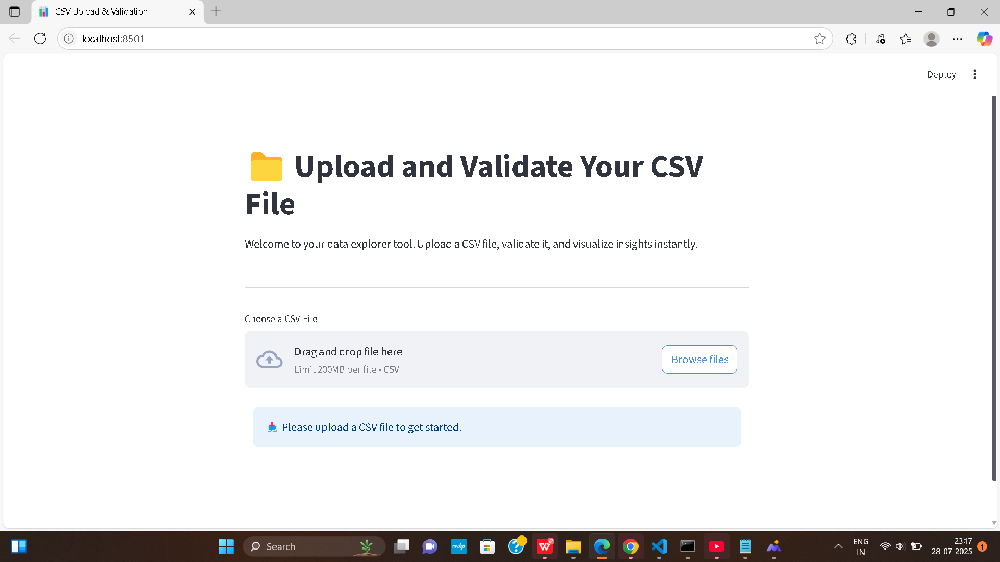
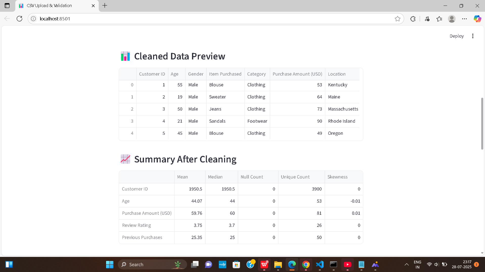
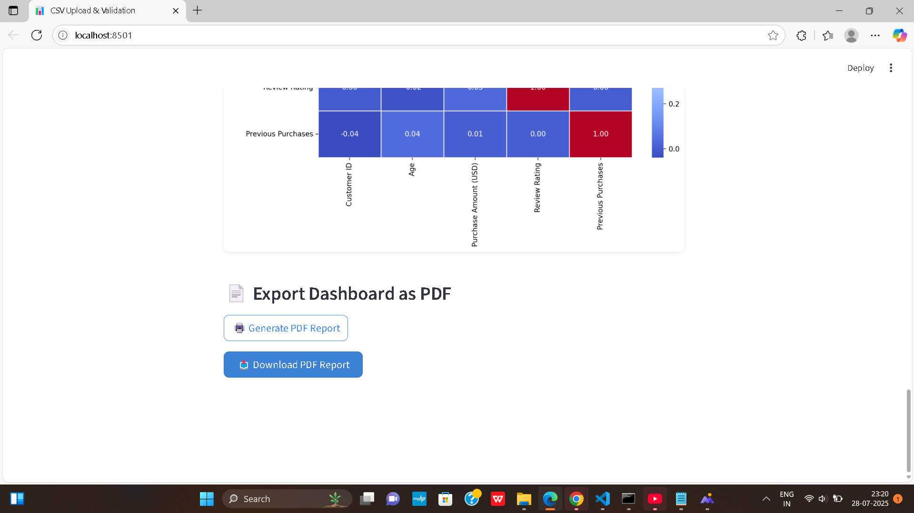

# 📊 Data Insights as a Service

A powerful SaaS tool that lets you **upload a CSV file**, and instantly get **automated insights**, **visualizations**, and an exportable **dashboard PDF**.

> 🧠 Coming soon: Chat with your data using a natural language interface powered by LLM.

---

## 🎯 Problem It Solves

Most business users or analysts struggle to:
Quickly explore and understand large CSV datasets
Build dashboards without writing code
Generate clean, shareable reports
Spend hours doing repetitive analysis for every new dataset

This tool solves that by providing:
✅ Instant insights with just one click — no coding or setup needed
✅ Auto-generated visualizations that make trends and patterns immediately clear
✅ PDF exports that are ready to share in seconds
✅ (Coming Soon) A chatbot interface to ask questions like “What are the top categories by revenue?”
✅ Minimal effort, maximum value — reduce hours of manual work to just a few seconds

---

## 🛠️ Features

| Feature | Description |
|--------|-------------|
| 📁 **Upload CSV** | Upload any CSV to begin |
| 📊 **Automated EDA** | Generate profiling reports |
| 📈 **Smart Visualizations** | Generate bar, pie, line, and correlation charts |
| 📄 **Export Dashboard** | Save your insights and visuals as a PDF |
| 💬 **Ask Your Data (Coming Soon)** | Chatbot interface powered by an LLM for querying your dataset |

---

# 📊 CSV Insights Dashboard






---

## 🧠 Tech Stack

- **Frontend/UI**: [Streamlit](https://streamlit.io)
- **Data Analysis**: Pandas, NumPy
- **Auto EDA**: YDataProfiling
- **Visualizations**: Seaborn, Plotly, Matplotlib
- **PDF Export**: FPDF
- **(Optional)**: OpenAI / HuggingFace Transformers for LLM Chat

---

## 🚀 Getting Started

### 🔧 Installation

```bash
git clone https://github.com/Himakar06/insights-service.git
cd insights-service
pip install -r requirements.txt
streamlit run src/app.py
